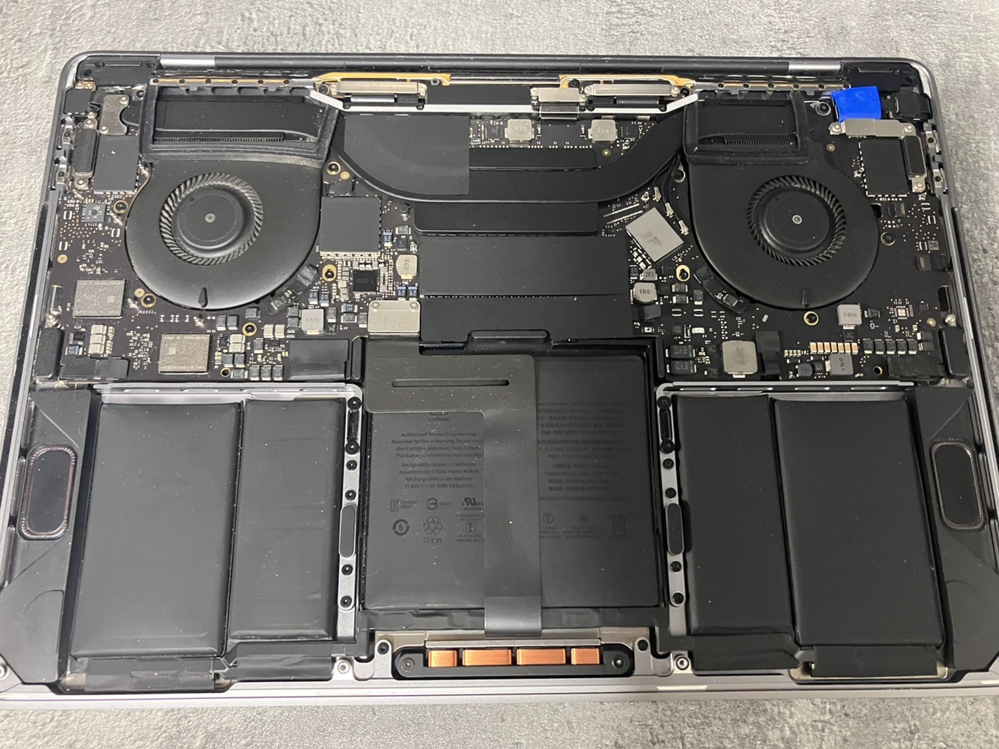

### 0 - 들어가면서
***
나의 맥북 프로는 2020년 13인치 모델이다. 슬프게도 애플이 M1 모델을 발표하기전 마지막 Intel CPU 모델이다.
그 때는 참 후회를 많이 했던 것 같다. 상대적으로 M1 모델이 가격대비 성능이나 배터리 사용량이 좋았기 때문에 조금만 늦게 맥북을 구매했더라면 현명한 소비를 할 수 있을텐데 하고 말이다.

개발자이다보니, 맥북 프로의 사양도 기본 모델이 아닌 i7 모델을 구매하여 구매한 가격이 300초반이였는데 사실 맥북 자체로 고성능의 프로그램을 사용하지 않다 보니 괜한 과소비 였던 것 같다. 그 돈으로 메모리에 더 투자하는게 맞았을 거라는 생각이 있다.

아무튼 이런 추억이 있는 애플 프로를 잘 사용하고 있다가 문제가 발생하게 되었다. 아는 사람은 알고 있는 지독한 터치 바 깜박이는 문제이다.

### 1 - Touch bar flickering 
***
맥북의 터치바가 깜박이는 모습은 다음과 같다.

 

보시는 바와 같이 터치바가 정신없이 깜박거리는 것을 확인할 수 있다. 문제는 이것이 밖에서 사용할 떄 엄청난 사람들의 시선 집중과 또는 노트북을 열어논 채로 잠자기 모드를 했을 때도 저런 현상이 나기 때문에 새벽 중에 잠을 깨거나 잠들지 못하는 상황이 발생한다는 것이다.

이 문제는 나만의 문제가 아니라 다음의 키워드로 검색하면 문제가 발생하는 다른 사용자들이 엄청 많다는 것이다.
[macbook touch bar flickering](https://www.google.com/search?q=macbook+touch+bar+flickering)

생각보다 많은 사용자들이 겪고 있는 중요한 이슈라고 생각해서 2년 전부터 꾸준히 해결 방법을 모니터링 해봤지만, 명확하게 해결되는 방법은 하나도 없었다.
저 현상이 발생하여 영상을 찍은 날짜를 확인해보니 2021년 11월 29일이였다. 물론 나는 애플 케어를 가입한 사용자이므로 애플 공식 센터를 방문하여 수리를 요청하였으나, 받은 답변은 문제가 되는 부분이 없어서 수리를 못해준다는 내용이였다. 이 때 애플 서비스에 대한 실망감과 함께 애플 케어에 대한 쓸모에 대해 많은 생각이 들었다.

해당 이슈로 인해 노트북을 멀리하기 시작했으며, 노트북을 덮어둔 상태로 외부 모니터로만 사용하기 시작했다. 나에게로는 엄청나게 손해가 아닐수가 없었다. 2대의 모니터링 사용할 수 있음에도 하나의 모니터만 사용해야하고, 외부에서 작업하기가 엄청나게 곤란하기 때문이다.

2년이 조금 넘은 이 시점에서 나는 고민을 할 수 밖에 없었다. 새로운 노트북을 사기에는 현재 노트북의 성능이나 이슈가 전혀 없었기 때문이다. 추가적인 지출을 막기 위해 나는 이 문제를 스스로 고쳐보기로 하였다.
(사실 나는 이런 이슈가 많기 때문에 애플 측에서 고칠 수 있는 방안을 내줄주 알고 기다리긴 하였다.)

### 2- How to fix?
***
고치는 방법은 심플하다. 물리적으로 하드웨어에서 제거하면 된다.
물론 소프트웨어적으로 고민을 해봤지만 효과적이기 않을 것 이라고 생각하였고, 터치바를 사용하는 빈도가 굉장히 적었기 때문에 아예 물리적으로 전원을 제거하는 방법을 선택하였다. 이미 애플 케어에 대한 실망감과 함께 애플 케어가 종료되었기 때문에 나는 무모한 도전을 하였다.

방법은 두가지 중 하나였다. 나는 이 작업이 간단할 줄 일고 인터넷에서 touch bar replace하는 youtube를 찾아서 맥북을 개봉해보았는데... 맥북을 처음 열어 본 감상은 영상을 따라해서 분해를 해도 조립을 할 수 있을까에 대한 부분이였다. 나에겐 엄청 복잡하게 느껴졌다. 
그래서 생각한 방식은 touch bar에 연결되어 있는 선을 잘라버리는 것을 생각했는데, 아무래도 전자기기에서 그러한 방식은 좋지 않을 것 같았기 때문에 과감히 도전을 해보았다. 
결과적 말하자면 touch bar을 물리적으로 제거하는 방법은 엄청나게 심플하며, 많은 부품을 해제할 필요가 없다. 배터리 정도만 해제하면 작업할 수 있다는 것을 알지만, 나는 이 하드웨어를 아직 이해하고 있지 못하기 때문에 대부분의 나사를 해제하고 확인하였다.
(이 과정에서 조립을 도와주는 일부 테이프를 손상시켰으며 나는 이제 맥북을 다시는 해제하지 못하는 상황이다.)

 

위와 같이 완전히 분해하면서 touch bar의 하드웨어가 어떻게 메인보드와 구성되는지 확인하였다. 사실 각 단계별로 사진을 찍었어야 하는 아쉬움이 있다. 이렇게 포스틸할 생각을 못해서 작업이 완료된 사진을 찾지 못했다.
(구글에 검색하면 쉽게 나올 지 알았는데 내 메인보드와 동일한 제품을 찾는게 너무 어렵다. 또한 내가 기본 모델이 아닌 i7모델이라 그럴 수도 있다.)

결과적으로 전체적인 분해 작업을 통해 touch bar의 연결 케이블들을 확인할 수 있었고, 이를 분리한 상태로 다시 조립하기로 하였다. 그리고 분리된 케이블이 고정되지 않고 움직여서 다른 부분과의 접촉으로 문제가 발생하지 않도록 절연 테이프를 감아서 혹여 모를 상황에 대비할 수 있도록 하였다.

사실 제일 큰 문제는 맥북이 기동될때 하드웨어 상태를 체크하는 로직이 있을까 걱정이였다. 그럴 경우 정상적으로 부팅이 되지 않는다면 나의 이 해결 방법은 사용할 수 없기 때문이다.

다행히도 touch bar의 케이블을 제거하는 것으로는 맥북의 부팅에는 영향이 없었고 정상적으로 사용할 수 있었다.

나와 같은 고민을 가지고 있다면 자신의 touch bar 하드웨어를 확인하고 케이블을 제거하고 수행하길 바란다. 나의 이 경험이 많은 사람에게 도움이 되었으면 한다.

작업한 사진은 다음과 같다.

 
