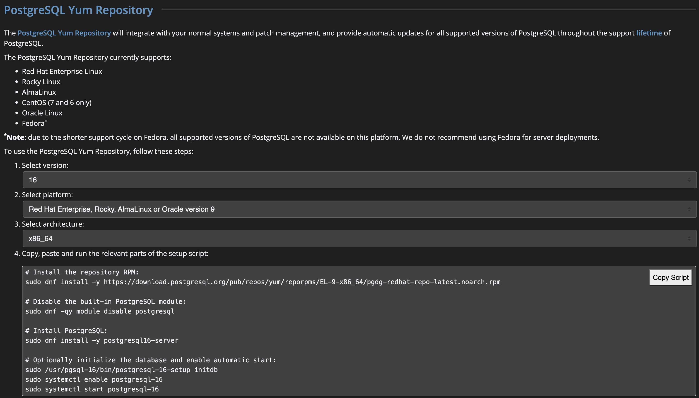

### 0 - 들어가면서
***
Open Source DB에 대한 수요가 늘어나면서 Postgres를 많이 사용한다는 이야기를 들었다.
그래서 Postgres를 설치하는 방법을 정리해두려고 한다.
아키텍처와 관련된 내용은 별도로 다루기로 하고, 이 페이지에서는 설치 관련된 내용만 다루도록 한다.

### 1 - 설치
***

수행되는 서버의 환경을 확인한다. wsl 내부의 운영체제에서 테스트를 하였다.
centos이후 버전인 rocky를 사용한 환경이다.
테스트를 위해 환경을 새로 구성하기 쉽기 때문에 wsl를 이용한다.

'''
[root@DESKTOP-UJ89AQE ~]# cat /etc/*release
Oracle Linux Server release 8.7
NAME="Oracle Linux Server"
VERSION="8.7"
ID="ol"
ID_LIKE="fedora"
VARIANT="Server"
VARIANT_ID="server"
VERSION_ID="8.7"
PLATFORM_ID="platform:el8"
PRETTY_NAME="Oracle Linux Server 8.7"
ANSI_COLOR="0;31"
CPE_NAME="cpe:/o:oracle:linux:8:7:server"
HOME_URL="https://linux.oracle.com/"
BUG_REPORT_URL="https://bugzilla.oracle.com/"

ORACLE_BUGZILLA_PRODUCT="Oracle Linux 8"
ORACLE_BUGZILLA_PRODUCT_VERSION=8.7
ORACLE_SUPPORT_PRODUCT="Oracle Linux"
ORACLE_SUPPORT_PRODUCT_VERSION=8.7
Red Hat Enterprise Linux release 8.7 (Ootpa)
Oracle Linux Server release 8.7
'''

 
설치 방법은 공식 홈페이지를 참조한다. 공식 문서에서 설치하고자 하는 버전과 플랫폼을 선택하고 아키텍처를 선택하고 스크립트 따라 설치한다.
https://www.postgresql.org/download/linux/redhat/

'''
# Install the repository RPM:
sudo dnf install -y https://download.postgresql.org/pub/repos/yum/reporpms/EL-9-x86_64/pgdg-redhat-repo-latest.noarch.rpm

# Disable the built-in PostgreSQL module:
sudo dnf -qy module disable postgresql

# Install PostgreSQL:
sudo dnf install -y postgresql16-server

# Optionally initialize the database and enable automatic start:
sudo /usr/pgsql-16/bin/postgresql-16-setup initdb
sudo systemctl enable postgresql-16
sudo systemctl start postgresql-16
'''

위에서 initdb 수행 시 다음과 같은 에러가 발생한다고 하는데, 원인은 WSL은 루트 시스템 프로세스가 systemd가 아닌 init이기 때문이란다. (무슨 말인가)
pstree로 확인할 수 있다고한다.
'''
[root@DESKTOP-UJ89AQE ~]# sudo /usr/pgsql-16/bin/postgresql-16-setup initdb
System has not been booted with systemd as init system (PID 1). Can't operate.
Failed to connect to bus: Host is down
failed to find PGDATA setting in postgresql-16.service
'''

'''
[root@DESKTOP-UJ89AQE ~]# pstree
init(OracleLinu─┬─SessionLeader───Relay(12)─┬─bash───pstree
                │                           └─6*[gpg-agent]
                ├─init───{init}
                └─{init(OracleLinu}
'''

다음의 wsl.conf 파일을 생성해주고 wsl을 재실행하면 문제는 해결된다.
'''
[root@DESKTOP-UJ89AQE ~]# cat /etc/wsl.conf
[boot]
systemd=true
'''

재실행 후 pstree를 명령어를 사용해보면 시스템 체계가 변경된 것을 확인할 수 있다.
'''
C:\Users\jskim>wsl --shutdown

C:\Users\jskim>wsl -u root   
[root@DESKTOP-UJ89AQE jskim]# pstree
systemd─┬─2*[agetty]
        ├─dbus-daemon
        ├─init-systemd(Or─┬─SessionLeader───Relay(81)───bash───pstree
        │                 ├─init───{init}
        │                 ├─login───bash
        │                 └─{init-systemd(Or}
        ├─rsyslogd───2*[{rsyslogd}]
        ├─sshd
        ├─systemd───(sd-pam)
        ├─systemd-journal
        └─systemd-logind
'''

다시 다음의 명령어를 사용해 postgres를 실행한다.
'''
# Optionally initialize the database and enable automatic start:
sudo /usr/pgsql-16/bin/postgresql-16-setup initdb
Created symlink /etc/systemd/system/multi-user.target.wants/postgresql-16.service → /usr/lib/systemd/system/postgresql-16.service.
sudo systemctl enable postgresql-16
sudo systemctl start postgresql-16
'''